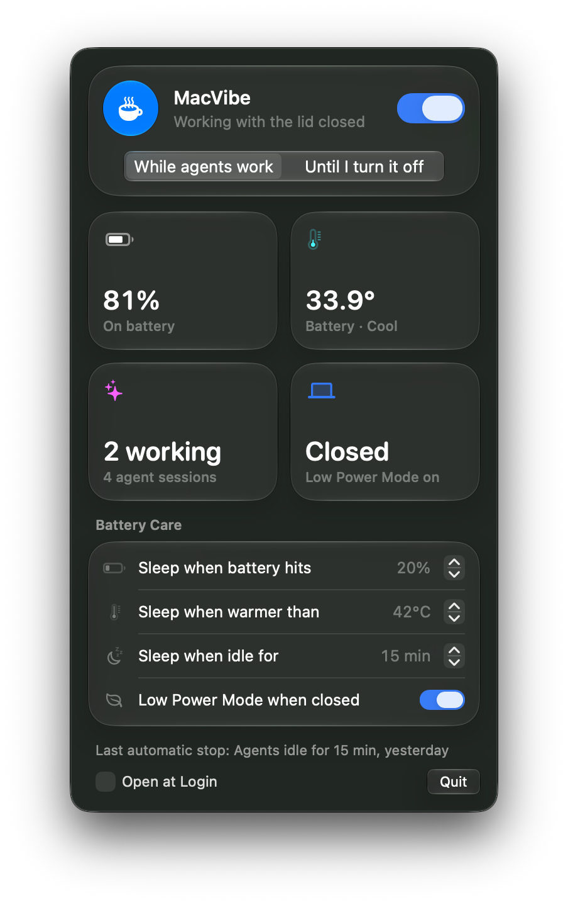
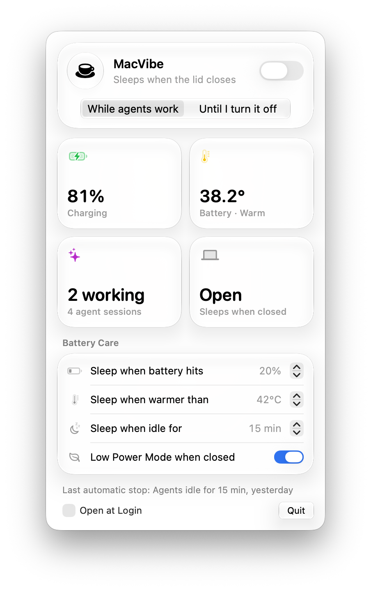
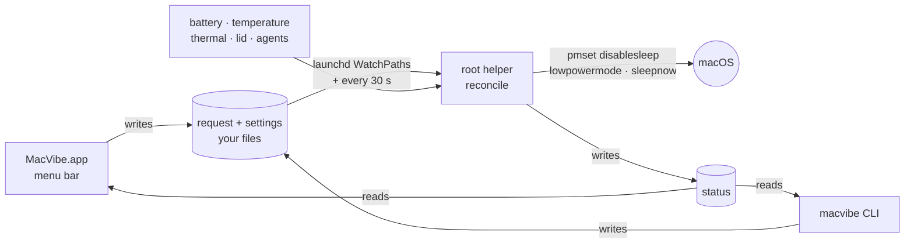

<div align="center">


# MacVibe

**Close the lid. Your AI coding agents keep working, and your battery stays healthy.**

Keep your MacBook awake with the lid closed while **Claude Code**, **OpenAI Codex**, **Gemini CLI**, **opencode**, **aider** and other AI agents code. No external monitor needed. A native macOS menu bar app with Liquid Glass, and it turns itself off when your agents finish, the battery runs low, or the Mac gets hot.

[](https://github.com/htsecurity/macvibe/releases/latest)
[](#requirements)
[](#requirements)
[](https://github.com/htsecurity/macvibe/actions/workflows/ci.yml)
[](LICENSE)




</div>

---

## Why MacVibe?

You start a long Claude Code or Codex task, close your MacBook, and put it down. When you come back, nothing got done: **macOS sleeps the moment the lid closes**. `caffeinate`, "Prevent automatic sleeping" and most keep-awake apps only stop *idle* sleep. The lid still wins, unless you have an external display, keyboard and charger plugged in (clamshell mode).

MacVibe keeps the Mac awake with the lid closed **only while it's useful and safe**:

- 🤖 **Knows when your agents are working.** It detects Claude Code, Codex, Gemini CLI, opencode and aider sessions and lets the Mac sleep once they've been idle for 15 minutes.
- 🔋 **Protects the battery.** It stops at 20% battery, when the battery reaches 42°C, or when macOS reports heavy thermal pressure, and turns on Low Power Mode while the lid is closed.
- 🛡️ **Fails safe.** Every automatic stop ends the session, and a reboot always restores normal sleep. The helper forces sleep back on whenever nothing is requested, so a Mac can't get stuck "never sleeping" in a bag.
- ✨ **Feels native.** A SwiftUI menu bar app with macOS 26 Liquid Glass, in light and dark mode, plus a `macvibe` command for the terminal and SSH.
- 🪶 **Tiny and transparent.** A few hundred lines of bash plus one small Swift app. Nothing runs continuously: launchd runs a quick check every 30 seconds. Open source (MIT) and tested.

## Install

### Option 1: Download (recommended, no Xcode needed)

1. Download **[MacVibe.zip](https://github.com/htsecurity/macvibe/releases/latest/download/MacVibe.zip)** from the [latest release](https://github.com/htsecurity/macvibe/releases/latest) and double-click it to unzip.
2. Open **Terminal** and run:
   ```bash
   cd ~/Downloads/MacVibe && sudo ./install.sh
   ```
3. Type your Mac password (nothing appears while you type) and press Enter.

A cup ☕ appears in your menu bar. Click it and flip the switch.

<details>
<summary>Or as a one-liner</summary>

```bash
curl -fsSL -o /tmp/MacVibe.zip https://github.com/htsecurity/macvibe/releases/latest/download/MacVibe.zip \
  && ditto -x -k /tmp/MacVibe.zip /tmp && sudo /tmp/MacVibe/install.sh
```
</details>

### Option 2: Build from source

Needs Xcode 26+ (or its Command Line Tools with the macOS 26 SDK).

```bash
git clone https://github.com/htsecurity/macvibe.git
cd macvibe && sudo ./install.sh
```

### Requirements

- **macOS 26 Tahoe or later** for the menu bar app (Liquid Glass). On older macOS, `install.sh` installs the helper and the `macvibe` command only.
- Apple silicon or Intel (universal binary).
- Admin password once, at install. After that, turning it on and off never asks for a password.

## Use it

**Menu bar:** click the cup, flip the switch, and choose a mode:

| Mode | With the lid closed… |
|---|---|
| **While agents work** | stays awake while an agent is busy, then sleeps after 15 min of no agent activity |
| **Until I turn it off** | stays awake until you switch it off (the safety stops still apply) |

**Terminal** (handy over SSH):

```bash
macvibe on              # awake with the lid closed while agents work
macvibe on --forever    # awake until you run `macvibe off`
macvibe off             # back to normal sleep
macvibe status          # lid, battery, temperature, agents, countdown
macvibe set min-battery 25   # also: max-temp 35-50, idle 1-240, low-power on|off
macvibe log             # what happened and when
```

```text
$ macvibe status
MacVibe  ● Awake with lid closed (while agents work)
  Lid         closed
  Battery     81% (battery)
  Heat        33.9°C, thermal nominal
  Agents      2 of 4 working
  Low Power   on (lid closed)
  Safety      sleeps at 20% battery or 42°C; after 15 min idle (lid closed)
```

## Battery care and safety

MacVibe stops keeping the Mac awake, and puts it to sleep if the lid is closed, when:

| Trigger | Default | Setting |
|---|---|---|
| Battery low (not charging) | ≤ 20% | 5–60% |
| Battery temperature | ≥ 42°C on two checks in a row | 35–50°C |
| macOS thermal pressure | "heavy" on two checks in a row | fixed |
| Agents idle, lid closed | 15 min ("While agents work") | 1–240 min |
| Mac restarted | always | fixed |

While it keeps the Mac awake with the lid closed, it switches on **Low Power Mode** for battery power and restores your own setting afterwards. You get a notification whenever it stops by itself.

> [!WARNING]
> Don't carry a running MacBook in a closed bag. Cooling is weaker with the lid closed, and MacVibe's heat stop reacts within about a minute, not instantly. While MacVibe is on, Apple menu → Sleep is blocked too. Turn MacVibe off first.

## How it works

Closing the lid forces sleep through a system power policy that ordinary sleep assertions can't override. The one switch that does is `pmset disablesleep 1`. That's powerful and risky, so MacVibe wraps it in a small root helper that only turns it on when you ask and keeps checking whether it's still safe.



- **Agent detection:** Claude Code runs `caffeinate` while it's working, and MacVibe uses that. For other agents (Codex, Gemini CLI, opencode, aider), an agent counts as busy if its process tree used at least 3% CPU since the last check. Idle sessions sitting at a prompt use about 1%.
- **Sensors:** battery %, charger and temperature from the `AppleSmartBattery` IORegistry entry; thermal pressure from `com.apple.system.thermalpressurelevel`; lid state from `AppleClamshellState`.
- **No password after install:** the app and CLI write two plain files you own, inside a root-owned folder. The helper reads them with strict parsing: only exact values, numbers clamped, symlinks refused.

<details>
<summary>What gets installed where</summary>

| Path | What |
|---|---|
| `/Applications/MacVibe.app` | Menu bar app |
| `/usr/local/bin/macvibe` | CLI |
| `/Library/PrivilegedHelperTools/macvibe/` | Root helper (`reconcile`, `core.sh`) |
| `/Library/LaunchDaemons/com.macvibe.reconcile.plist` | launchd job: every 30 s and on request |
| `/Library/Application Support/macvibe/` | `request` and `settings` (owned by you) |
| `/var/db/macvibe/` | Helper state and `status` |
| `/var/log/macvibe.log` | Event log |

</details>

## FAQ

<details>
<summary><b>How do I keep my MacBook awake with the lid closed without an external monitor?</b></summary>

macOS only stays awake with the lid closed in clamshell mode, which needs an external display, a keyboard/mouse and a charger. Without those, the only reliable switch is `sudo pmset -a disablesleep 1`, and it stays on until you remember to undo it. MacVibe manages that switch for you and turns it off automatically when your work is done or the battery or temperature gets risky.
</details>

<details>
<summary><b>Why doesn't <code>caffeinate</code> keep my Mac awake when I close the lid?</b></summary>

`caffeinate` (and the assertion Claude Code creates while it works) prevents *idle* sleep. Closing the lid is a different trigger: without an external display, macOS sleeps anyway. MacVibe uses `pmset disablesleep`, which covers lid-close sleep, and adds the safety checks that raw `pmset` doesn't have.
</details>

<details>
<summary><b>Will this hurt my battery?</b></summary>

Running with the lid closed traps a little more heat, and heat is what ages lithium batteries. That's why MacVibe watches the battery temperature and macOS thermal pressure, stops at low charge, turns on Low Power Mode while the lid is closed, and, in the default mode, stops as soon as your agents are done instead of running all night for nothing.
</details>

<details>
<summary><b>Can I run my agents overnight on the charger?</b></summary>

Yes. Use **Until I turn it off** (or `macvibe on --forever`). The heat stops still apply. Keep the Mac on a hard, open surface.
</details>

<details>
<summary><b>Which AI coding tools does it detect?</b></summary>

Claude Code (`claude`), OpenAI Codex CLI and the Codex app's agent (`codex`), Gemini CLI (`gemini`), opencode and aider, including ones installed with npm or pip. Any terminal session counts; you can run many at once. With **Until I turn it off**, detection doesn't matter, so any long-running job works: builds, test suites, downloads, local LLMs.
</details>

<details>
<summary><b>Does it work over SSH or with Claude Code remote sessions?</b></summary>

Yes. The Mac stays on the network with the lid closed, so SSH, remote sessions and anything else that needs connectivity keep working. `macvibe` works over SSH too.
</details>

<details>
<summary><b>What runs as root, and is that safe?</b></summary>

One bash script, `reconcile`, started by launchd. It runs `pmset`, `ioreg`, `ps` and `notifyutil`, and only ever reads your two request files, using strict validation. Everything is in this repo and covered by tests: see `lib/core.sh` and `libexec/macvibe-reconcile`. The helper lives in the OS-protected `/Library/PrivilegedHelperTools`, so other software running as you can't modify it.
</details>

<details>
<summary><b>macOS says the app can't be opened / "unidentified developer"</b></summary>

The release app is ad-hoc signed, not notarized by Apple. `install.sh` clears the download quarantine flag on the app it installs. If you'd rather not trust a prebuilt binary, build from source (Option 2); it's one command.
</details>

<details>
<summary><b>How do I uninstall?</b></summary>

```bash
sudo ./install.sh --uninstall
```
This removes the app, CLI, helper and launchd job, and restores normal sleep and your Low Power Mode setting.
</details>

## Development

```bash
./check.sh             # syntax, plists, all tests, universal app build
./check.sh --no-app    # skip Swift (no macOS 26 SDK needed)
app/build.sh && open build/MacVibe.app --args --preview   # see the panel in a window
scripts/release.sh     # build dist/MacVibe.zip
```

| Path | |
|---|---|
| `lib/core.sh` | Pure decision logic: modes, safety stops, agent detection, strict parsing |
| `libexec/macvibe-reconcile` | Root helper: sensors → decision → `pmset` |
| `bin/macvibe` | CLI |
| `app/Sources/` | SwiftUI menu bar app (`Store.swift` data, `PanelView.swift` UI) |
| `tests/` | Bash tests with fake `pmset`/`ioreg`/`ps`, plus an app test against the real helper |

Issues and pull requests are welcome. Please run `./check.sh` first.

## License

[MIT](LICENSE). Free for personal and commercial use.

<div align="center">

**If MacVibe kept your agents coding while you were away, a ⭐ helps other people find it.**

</div>
